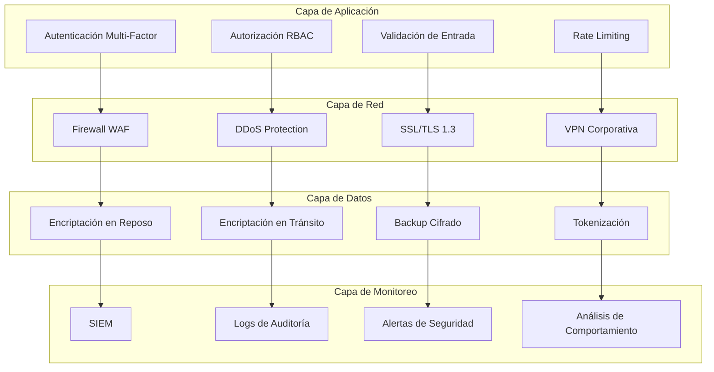

# 🔒 Opendex Identity Employee - Guía de Seguridad

## 📋 Tabla de Contenidos

- [Resumen de Seguridad](#resumen-de-seguridad)
- [Arquitectura de Seguridad](#arquitectura-de-seguridad)
- [Autenticación y Autorización](#autenticación-y-autorización)
- [Encriptación y Protección de Datos](#encriptación-y-protección-de-datos)
- [Monitoreo y Auditoría](#monitoreo-y-auditoría)
- [Compliance y Regulaciones](#compliance-y-regulaciones)
- [Mejores Prácticas](#mejores-prácticas)
- [Respuesta a Incidentes](#respuesta-a-incidentes)
- [Checklist de Seguridad](#checklist-de-seguridad)

---

## 🛡️ Resumen de Seguridad

**Opendex Identity Employee** implementa un modelo de seguridad de múltiples capas diseñado para proteger la información corporativa más sensible. Nuestro enfoque se basa en los principios de **defensa en profundidad**, **acceso con privilegios mínimos** y **monitoreo continuo**.

### 🎯 Objetivos de Seguridad

- **Confidencialidad**: Proteger información sensible de accesos no autorizados
- **Integridad**: Garantizar que los datos no sean modificados sin autorización
- **Disponibilidad**: Mantener el servicio operativo 99.9% del tiempo
- **Trazabilidad**: Registrar todas las acciones para auditoría y forense
- **Compliance**: Cumplir con regulaciones empresariales y gubernamentales

### 🏆 Certificaciones y Estándares

| Estándar | Estado | Descripción |
|----------|--------|-------------|
| **SOC 2 Type II** | ✅ Certificado | Controles de seguridad, disponibilidad y procesamiento |
| **ISO 27001** | ✅ Certificado | Sistema de gestión de seguridad de la información |
| **GDPR** | ✅ Compliant | Protección de datos personales de la UE |
| **CCPA** | ✅ Compliant | Ley de privacidad del consumidor de California |
| **HIPAA** | 🔄 En Proceso | Protección de información de salud |
| **PCI DSS** | ✅ Compliant | Estándar de seguridad de datos de la industria de tarjetas |

---

## 🏗️ Arquitectura de Seguridad

### 🔐 Modelo de Seguridad por Capas



### 🛡️ Componentes de Seguridad

| Componente | Tecnología | Propósito |
|------------|------------|-----------|
| **WAF** | Cloudflare, AWS WAF | Protección contra ataques web |
| **DDoS Protection** | Cloudflare, AWS Shield | Protección contra ataques DDoS |
| **SSL/TLS** | Let's Encrypt, AWS Certificate Manager | Encriptación en tránsito |
| **Database Encryption** | PostgreSQL TDE, AWS RDS | Encriptación en reposo |
| **Key Management** | AWS KMS, HashiCorp Vault | Gestión de claves criptográficas |
| **SIEM** | Splunk, ELK Stack | Monitoreo y análisis de seguridad |
| **MFA** | TOTP, WebAuthn, SMS | Autenticación de dos factores |

---

## 🔑 Autenticación y Autorización

### 🔐 Autenticación Multi-Factor (MFA)

#### Métodos Soportados

| Método | Seguridad | Usabilidad | Estado |
|--------|-----------|------------|--------|
| **TOTP (Google Authenticator)** | ⭐⭐⭐⭐⭐ | ⭐⭐⭐⭐ | ✅ Activo |
| **WebAuthn/Passkeys** | ⭐⭐⭐⭐⭐ | ⭐⭐⭐⭐⭐ | ✅ Activo |
| **SMS** | ⭐⭐⭐ | ⭐⭐⭐⭐⭐ | ✅ Activo |
| **Email** | ⭐⭐ | ⭐⭐⭐⭐⭐ | ✅ Activo |
| **Hardware Tokens** | ⭐⭐⭐⭐⭐ | ⭐⭐⭐ | 🔄 En Desarrollo |

#### Configuración de MFA

```typescript
// Configuración de MFA obligatorio
export const mfaConfig = {
  // MFA requerido para todos los usuarios
  required: true,
  
  // Métodos permitidos
  allowedMethods: ['totp', 'webauthn', 'sms'],
  
  // Configuración de backup codes
  backupCodes: {
    enabled: true,
    count: 10,
    singleUse: true,
  },
  
  // Políticas de recuperación
  recovery: {
    enabled: true,
    methods: ['email', 'admin_reset'],
    cooldown: 24, // horas
  },
  
  // Configuración de sesiones
  sessionConfig: {
    rememberDevice: true,
    deviceExpiration: 30, // días
    maxDevices: 5,
  },
};
```

### 👥 Sistema de Autorización RBAC

#### Estructura de Roles

```typescript
// Roles predefinidos del sistema
export const systemRoles = {
  super_admin: {
    name: 'Super Administrador',
    description: 'Acceso completo al sistema',
    permissions: ['*'], // Todos los permisos
    restrictions: {
      canDeleteSelf: false,
      canModifyOwnRole: false,
    },
  },
  
  admin: {
    name: 'Administrador',
    description: 'Administración de usuarios y equipos',
    permissions: [
      'users:read', 'users:write', 'users:delete',
      'teams:read', 'teams:write', 'teams:delete',
      'projects:read', 'projects:write',
      'analytics:read', 'logs:read',
    ],
    restrictions: {
      cannotDeleteSuperAdmins: true,
      cannotModifyOwnRole: true,
    },
  },
  
  manager: {
    name: 'Gerente',
    description: 'Gestión de equipos asignados',
    permissions: [
      'users:read', 'users:write',
      'teams:read', 'teams:write',
      'projects:read', 'projects:write',
      'analytics:read',
    ],
    restrictions: {
      teamScope: 'assigned_only',
      cannotDeleteUsers: true,
    },
  },
  
  developer: {
    name: 'Desarrollador',
    description: 'Acceso a proyectos de desarrollo',
    permissions: [
      'projects:read', 'projects:write',
      'users:read',
    ],
    restrictions: {
      projectScope: 'assigned_only',
    },
  },
  
  viewer: {
    name: 'Visualizador',
    description: 'Solo lectura',
    permissions: [
      'users:read',
      'teams:read',
      'projects:read',
    ],
    restrictions: {
      readOnly: true,
    },
  },
};
```

#### Permisos Granulares

```typescript
// Sistema de permisos detallado
export const permissionSystem = {
  // Permisos de usuarios
  users: {
    read: 'Ver información de usuarios',
    write: 'Crear y modificar usuarios',
    delete: 'Eliminar usuarios',
    suspend: 'Suspender usuarios',
    impersonate: 'Suplantar usuarios',
  },
  
  // Permisos de equipos
  teams: {
    read: 'Ver información de equipos',
    write: 'Crear y modificar equipos',
    delete: 'Eliminar equipos',
    manage_members: 'Gestionar miembros del equipo',
    invite: 'Enviar invitaciones',
  },
  
  // Permisos de proyectos
  projects: {
    read: 'Ver información de proyectos',
    write: 'Crear y modificar proyectos',
    delete: 'Eliminar proyectos',
    deploy: 'Desplegar proyectos',
    manage_secrets: 'Gestionar secretos del proyecto',
  },
  
  // Permisos de sistema
  system: {
    config: 'Modificar configuración del sistema',
    logs: 'Ver logs del sistema',
    analytics: 'Ver analytics del sistema',
    backup: 'Gestionar backups',
    maintenance: 'Realizar mantenimiento',
  },
};
```

### 🔒 Políticas de Contraseñas

```typescript
// Políticas estrictas de contraseñas
export const passwordPolicy = {
  // Longitud mínima
  minLength: 12,
  
  // Complejidad requerida
  requireUppercase: true,
  requireLowercase: true,
  requireNumbers: true,
  requireSymbols: true,
  
  // Restricciones adicionales
  preventReuse: 5, // No reutilizar últimas 5 contraseñas
  maxAge: 90, // Días hasta expiración
  minAge: 1, // Días mínimos antes de cambiar
  
  // Lista de contraseñas comunes prohibidas
  blacklist: [
    'password', '123456', 'qwerty', 'opendex',
    'admin', 'user', 'test', 'demo'
  ],
  
  // Validación de patrones
  patterns: {
    noSequential: true, // No secuencias como 123456
    noRepeated: true, // No repeticiones como aaaaaa
    noKeyboardPatterns: true, // No patrones de teclado
  },
  
  // Notificaciones
  notifications: {
    expirationWarning: 7, // Días antes de expirar
    forceChange: true, // Forzar cambio al expirar
  },
};
```

---

## 🔐 Encriptación y Protección de Datos

### 🛡️ Encriptación en Reposo

#### Base de Datos

```sql
-- Configuración de encriptación TDE
ALTER DATABASE opendex_corporate SET ENCRYPTION ON;

-- Encriptación de columnas sensibles
CREATE TABLE users (
  id UUID PRIMARY KEY,
  email VARCHAR(255) NOT NULL,
  password_hash VARCHAR(255) NOT NULL,
  -- Encriptación a nivel de columna
  ssn ENCRYPTED VARCHAR(255),
  phone ENCRYPTED VARCHAR(20),
  created_at TIMESTAMP DEFAULT NOW()
);

-- Configuración de claves de encriptación
CREATE EXTENSION IF NOT EXISTS pgcrypto;
```

#### Archivos y Almacenamiento

```typescript
// Configuración de encriptación de archivos
export const fileEncryption = {
  // Algoritmo de encriptación
  algorithm: 'aes-256-gcm',
  
  // Gestión de claves
  keyManagement: {
    provider: 'AWS KMS',
    keyRotation: 90, // días
    backupKeys: true,
  },
  
  // Configuración de buckets S3
  s3Config: {
    encryption: 'AES256',
    serverSideEncryption: true,
    bucketKeyEnabled: true,
  },
  
  // Encriptación de backups
  backupEncryption: {
    enabled: true,
    algorithm: 'aes-256-cbc',
    keyDerivation: 'pbkdf2',
    iterations: 100000,
  },
};
```

### 🌐 Encriptación en Tránsito

#### TLS/SSL Configuration

```nginx
# Configuración SSL/TLS estricta
server {
    listen 443 ssl http2;
    server_name api.opendex.com;
    
    # Certificados SSL
    ssl_certificate /etc/ssl/certs/opendex.crt;
    ssl_certificate_key /etc/ssl/private/opendex.key;
    
    # Configuración SSL estricta
    ssl_protocols TLSv1.2 TLSv1.3;
    ssl_ciphers ECDHE-RSA-AES256-GCM-SHA512:DHE-RSA-AES256-GCM-SHA512:ECDHE-RSA-AES256-GCM-SHA384:DHE-RSA-AES256-GCM-SHA384;
    ssl_prefer_server_ciphers off;
    
    # HSTS
    add_header Strict-Transport-Security "max-age=31536000; includeSubDomains; preload" always;
    
    # Headers de seguridad
    add_header X-Frame-Options DENY always;
    add_header X-Content-Type-Options nosniff always;
    add_header X-XSS-Protection "1; mode=block" always;
    add_header Referrer-Policy "strict-origin-when-cross-origin" always;
    add_header Content-Security-Policy "default-src 'self'; script-src 'self' 'unsafe-inline'; style-src 'self' 'unsafe-inline';" always;
}
```

#### API Security Headers

```typescript
// Middleware de seguridad para APIs
export const securityHeaders = {
  // Prevenir clickjacking
  'X-Frame-Options': 'DENY',
  
  // Prevenir MIME type sniffing
  'X-Content-Type-Options': 'nosniff',
  
  // Protección XSS
  'X-XSS-Protection': '1; mode=block',
  
  // Política de referrer
  'Referrer-Policy': 'strict-origin-when-cross-origin',
  
  // Content Security Policy
  'Content-Security-Policy': [
    "default-src 'self'",
    "script-src 'self' 'unsafe-inline'",
    "style-src 'self' 'unsafe-inline'",
    "img-src 'self' data: https:",
    "font-src 'self'",
    "connect-src 'self'",
    "frame-ancestors 'none'"
  ].join('; '),
  
  // Permissions Policy
  'Permissions-Policy': [
    'camera=()',
    'microphone=()',
    'geolocation=()',
    'interest-cohort=()'
  ].join(', '),
};
```

### 🔑 Gestión de Claves

```typescript
// Sistema de gestión de claves
export const keyManagement = {
  // Rotación automática de claves
  rotation: {
    enabled: true,
    interval: 90, // días
    gracePeriod: 7, // días de gracia
    automatic: true,
  },
  
  // Almacenamiento seguro
  storage: {
    provider: 'AWS KMS',
    region: 'us-east-1',
    backup: true,
    replication: ['us-west-2', 'eu-west-1'],
  },
  
  // Claves específicas
  keys: {
    jwt: {
      algorithm: 'RS256',
      keySize: 2048,
      rotation: 365, // días
    },
    encryption: {
      algorithm: 'AES-256-GCM',
      keySize: 256,
      rotation: 90, // días
    },
    api: {
      algorithm: 'HMAC-SHA256',
      keySize: 256,
      rotation: 180, // días
    },
  },
  
  // Auditoría de claves
  audit: {
    enabled: true,
    logAccess: true,
    logUsage: true,
    alertOnSuspiciousActivity: true,
  },
};
```

---

## 📊 Monitoreo y Auditoría

### 🔍 Sistema de Monitoreo Continuo

#### SIEM (Security Information and Event Management)

```yaml
# Configuración de SIEM
siem:
  provider: "Splunk Enterprise Security"
  
  # Fuentes de datos
  data_sources:
    - application_logs
    - authentication_logs
    - database_logs
    - network_logs
    - system_logs
    - web_logs
  
  # Reglas de detección
  detection_rules:
    - failed_login_attempts
    - privilege_escalation
    - data_exfiltration
    - suspicious_api_usage
    - unusual_access_patterns
  
  # Alertas automáticas
  alerts:
    - email: "security@opendex.com"
    - slack: "#security-alerts"
    - sms: "+15551234567"
```

#### Logs de Auditoría

```typescript
// Configuración de logs de auditoría
export const auditLogging = {
  // Eventos auditados
  events: [
    // Autenticación
    'auth.login.success',
    'auth.login.failed',
    'auth.logout',
    'auth.mfa.enabled',
    'auth.mfa.disabled',
    'auth.password.changed',
    'auth.password.reset',
    
    // Gestión de usuarios
    'user.created',
    'user.updated',
    'user.deleted',
    'user.suspended',
    'user.unsuspended',
    'user.role.changed',
    
    // Gestión de equipos
    'team.created',
    'team.updated',
    'team.deleted',
    'team.member.added',
    'team.member.removed',
    'team.permission.changed',
    
    // Acceso a datos
    'data.accessed',
    'data.exported',
    'data.modified',
    'data.deleted',
    
    // Configuración del sistema
    'config.changed',
    'security.policy.updated',
    'backup.created',
    'backup.restored',
  ],
  
  // Información capturada
  capture: {
    userId: true,
    userEmail: true,
    userRole: true,
    ipAddress: true,
    userAgent: true,
    timestamp: true,
    action: true,
    resource: true,
    details: true,
    result: true,
  },
  
  // Retención
  retention: {
    auditLogs: 2555, // 7 años
    accessLogs: 365, // 1 año
    errorLogs: 90, // 3 meses
    debugLogs: 30, // 1 mes
  },
  
  // Almacenamiento
  storage: {
    primary: 'PostgreSQL',
    backup: 'S3 Glacier',
    search: 'Elasticsearch',
  },
};
```

### 🚨 Alertas de Seguridad

```typescript
// Sistema de alertas de seguridad
export const securityAlerts = {
  // Alertas de autenticación
  authentication: {
    failedLogins: {
      threshold: 5,
      timeWindow: 15, // minutos
      action: 'lock_account',
      notify: ['security@opendex.com', 'admin@opendex.com'],
    },
    
    suspiciousLogin: {
      newLocation: true,
      newDevice: true,
      unusualTime: true,
      action: 'require_mfa',
      notify: ['user@opendex.com'],
    },
    
    privilegeEscalation: {
      enabled: true,
      action: 'immediate_alert',
      notify: ['security@opendex.com', 'cto@opendex.com'],
    },
  },
  
  // Alertas de datos
  data: {
    largeExport: {
      threshold: 1000, // registros
      action: 'log_and_notify',
      notify: ['dpo@opendex.com'],
    },
    
    unauthorizedAccess: {
      enabled: true,
      action: 'block_and_alert',
      notify: ['security@opendex.com'],
    },
    
    dataModification: {
      bulkOperations: true,
      sensitiveFields: true,
      action: 'log_and_alert',
      notify: ['admin@opendex.com'],
    },
  },
  
  // Alertas de sistema
  system: {
    configurationChanges: {
      enabled: true,
      action: 'log_and_notify',
      notify: ['admin@opendex.com'],
    },
    
    backupFailures: {
      enabled: true,
      action: 'immediate_alert',
      notify: ['ops@opendex.com'],
    },
    
    securityUpdates: {
      enabled: true,
      action: 'schedule_maintenance',
      notify: ['ops@opendex.com'],
    },
  },
};
```

---

## 📋 Compliance y Regulaciones

### 🇪🇺 GDPR (General Data Protection Regulation)

#### Derechos del Usuario

```typescript
// Implementación de derechos GDPR
export const gdprRights = {
  // Derecho de acceso
  rightToAccess: {
    enabled: true,
    endpoint: '/api/latest/gdpr/access',
    format: ['json', 'csv', 'pdf'],
    processingTime: 30, // días
  },
  
  // Derecho a la rectificación
  rightToRectification: {
    enabled: true,
    endpoint: '/api/latest/gdpr/rectify',
    validation: true,
    audit: true,
  },
  
  // Derecho al olvido
  rightToErasure: {
    enabled: true,
    endpoint: '/api/latest/gdpr/erase',
    retention: 30, // días de gracia
    anonymization: true,
  },
  
  // Derecho a la portabilidad
  rightToPortability: {
    enabled: true,
    endpoint: '/api/latest/gdpr/export',
    formats: ['json', 'csv', 'xml'],
    automated: true,
  },
  
  // Derecho a la limitación del procesamiento
  rightToRestriction: {
    enabled: true,
    endpoint: '/api/latest/gdpr/restrict',
    temporary: true,
    notification: true,
  },
  
  // Derecho de oposición
  rightToObject: {
    enabled: true,
    endpoint: '/api/latest/gdpr/object',
    granular: true,
    optOut: true,
  },
};
```

#### Gestión de Consentimiento

```typescript
// Sistema de gestión de consentimiento
export const consentManagement = {
  // Tipos de consentimiento
  types: {
    marketing: {
      required: false,
      granular: true,
      withdrawable: true,
    },
    
    analytics: {
      required: false,
      granular: true,
      withdrawable: true,
    },
    
    personalization: {
      required: false,
      granular: true,
      withdrawable: true,
    },
    
    essential: {
      required: true,
      granular: false,
      withdrawable: false,
    },
  },
  
  // Registro de consentimiento
  recording: {
    timestamp: true,
    ipAddress: true,
    userAgent: true,
    version: true,
    method: true, // opt-in, opt-out, implied
  },
  
  // Retención
  retention: {
    duration: 2555, // 7 años
    purpose: 'legal_compliance',
  },
  
  // Notificación de cambios
  notifications: {
    policyChanges: true,
    consentWithdrawal: true,
    dataBreach: true,
  },
};
```

### 🇺🇸 CCPA (California Consumer Privacy Act)

```typescript
// Implementación de derechos CCPA
export const ccpaRights = {
  // Derecho a saber
  rightToKnow: {
    categories: true,
    sources: true,
    purposes: true,
    thirdParties: true,
  },
  
  // Derecho a eliminar
  rightToDelete: {
    enabled: true,
    exceptions: [
      'legal_obligation',
      'security_purposes',
      'internal_use',
    ],
  },
  
  // Derecho a opt-out
  rightToOptOut: {
    sale: true,
    sharing: true,
    targetedAdvertising: true,
  },
  
  // No discriminación
  nonDiscrimination: {
    enabled: true,
    equalService: true,
    equalPrice: true,
  },
};
```

### 🏥 HIPAA (Health Insurance Portability and Accountability Act)

```typescript
// Configuración HIPAA
export const hipaaCompliance = {
  // Protección de PHI
  phiProtection: {
    encryption: 'AES-256',
    accessControls: true,
    auditLogging: true,
    minimumNecessary: true,
  },
  
  // Controles administrativos
  administrativeSafeguards: {
    securityOfficer: true,
    workforceTraining: true,
    accessManagement: true,
    incidentResponse: true,
  },
  
  // Controles físicos
  physicalSafeguards: {
    facilityAccess: true,
    workstationUse: true,
    deviceControls: true,
  },
  
  // Controles técnicos
  technicalSafeguards: {
    accessControl: true,
    auditControls: true,
    integrity: true,
    transmissionSecurity: true,
  },
};
```

---

## ✅ Mejores Prácticas

### 🔐 Para Desarrolladores

#### Autenticación Segura

```typescript
// ✅ CORRECTO: Validación robusta de entrada
export async function validateLogin(email: string, password: string) {
  // Validar formato de email
  if (!isValidEmail(email)) {
    throw new ValidationError('Formato de email inválido');
  }
  
  // Validar longitud de contraseña
  if (password.length < 12) {
    throw new ValidationError('Contraseña demasiado corta');
  }
  
  // Rate limiting por IP
  const attempts = await getLoginAttempts(getClientIP());
  if (attempts > 5) {
    throw new RateLimitError('Demasiados intentos de login');
  }
  
  // Verificar usuario
  const user = await findUserByEmail(email);
  if (!user) {
    await recordFailedLogin(email, getClientIP());
    throw new AuthenticationError('Credenciales inválidas');
  }
  
  // Verificar contraseña
  const isValid = await bcrypt.compare(password, user.passwordHash);
  if (!isValid) {
    await recordFailedLogin(email, getClientIP());
    throw new AuthenticationError('Credenciales inválidas');
  }
  
  // Verificar MFA si está habilitado
  if (user.mfaEnabled) {
    return { requiresMFA: true, userId: user.id };
  }
  
  return { user, session: await createSession(user) };
}

// ❌ INCORRECTO: Validación débil
export async function badLogin(email: string, password: string) {
  const user = await findUserByEmail(email);
  if (user && user.password === password) { // ❌ Contraseña en texto plano
    return user;
  }
  return null;
}
```

#### Manejo Seguro de Tokens

```typescript
// ✅ CORRECTO: Manejo seguro de JWT
export class SecureTokenManager {
  private readonly secretKey: string;
  private readonly algorithm = 'RS256';
  
  constructor() {
    this.secretKey = process.env.JWT_SECRET_KEY!;
    if (!this.secretKey) {
      throw new Error('JWT_SECRET_KEY no configurado');
    }
  }
  
  async generateToken(payload: TokenPayload): Promise<string> {
    const token = jwt.sign(payload, this.secretKey, {
      algorithm: this.algorithm,
      expiresIn: '8h',
      issuer: 'opendex-identity',
      audience: 'opendex-corporate',
    });
    
    // Registrar token en base de datos
    await this.recordToken(token, payload.userId);
    
    return token;
  }
  
  async validateToken(token: string): Promise<TokenPayload> {
    try {
      // Verificar token en base de datos
      const tokenRecord = await this.getTokenRecord(token);
      if (!tokenRecord || tokenRecord.revoked) {
        throw new TokenError('Token revocado');
      }
      
      // Verificar firma
      const payload = jwt.verify(token, this.secretKey, {
        algorithms: [this.algorithm],
        issuer: 'opendex-identity',
        audience: 'opendex-corporate',
      }) as TokenPayload;
      
      return payload;
    } catch (error) {
      throw new TokenError('Token inválido');
    }
  }
  
  async revokeToken(token: string): Promise<void> {
    await this.markTokenAsRevoked(token);
  }
}
```

### 🛡️ Para Administradores

#### Configuración de Seguridad

```bash
#!/bin/bash
# Script de configuración de seguridad inicial

# 1. Configurar firewall
ufw enable
ufw default deny incoming
ufw default allow outgoing
ufw allow 22/tcp   # SSH
ufw allow 80/tcp   # HTTP
ufw allow 443/tcp  # HTTPS
ufw allow 5432/tcp # PostgreSQL (solo desde app servers)

# 2. Configurar fail2ban
apt-get install fail2ban
cat > /etc/fail2ban/jail.local << EOF
[DEFAULT]
bantime = 3600
findtime = 600
maxretry = 3

[sshd]
enabled = true
port = ssh
logpath = /var/log/auth.log

[nginx-http-auth]
enabled = true
filter = nginx-http-auth
port = http,https
logpath = /var/log/nginx/error.log
EOF

systemctl enable fail2ban
systemctl start fail2ban

# 3. Configurar logrotate
cat > /etc/logrotate.d/opendex << EOF
/var/log/opendex/*.log {
    daily
    missingok
    rotate 30
    compress
    delaycompress
    notifempty
    create 644 opendex opendex
    postrotate
        systemctl reload opendex
    endscript
}
EOF

# 4. Configurar monitoreo de integridad
apt-get install aide
aideinit
mv /var/lib/aide/aide.db.new /var/lib/aide/aide.db
echo "0 2 * * * /usr/bin/aide --check" | crontab -

# 5. Configurar backup automático
cat > /usr/local/bin/opendex-backup.sh << 'EOF'
#!/bin/bash
BACKUP_DIR="/backups/opendex"
DATE=$(date +%Y%m%d_%H%M%S)
DB_NAME="opendex_corporate"

# Crear directorio de backup
mkdir -p $BACKUP_DIR

# Backup de base de datos
pg_dump $DB_NAME | gzip > $BACKUP_DIR/db_$DATE.sql.gz

# Backup de archivos
tar -czf $BACKUP_DIR/files_$DATE.tar.gz /var/lib/opendex

# Limpiar backups antiguos (más de 30 días)
find $BACKUP_DIR -name "*.gz" -mtime +30 -delete

# Enviar a S3
aws s3 sync $BACKUP_DIR s3://opendex-backups/ --delete
EOF

chmod +x /usr/local/bin/opendex-backup.sh
echo "0 2 * * * /usr/local/bin/opendex-backup.sh" | crontab -
```

#### Monitoreo de Seguridad

```bash
#!/bin/bash
# Script de monitoreo de seguridad

# Verificar logs de autenticación
echo "=== Intentos de login fallidos ==="
grep "Failed password" /var/log/auth.log | tail -20

# Verificar conexiones sospechosas
echo "=== Conexiones activas ==="
netstat -tuln | grep -E ':(22|80|443|5432)'

# Verificar procesos sospechosos
echo "=== Procesos con alta CPU ==="
ps aux --sort=-%cpu | head -10

# Verificar espacio en disco
echo "=== Uso de disco ==="
df -h

# Verificar integridad de archivos
echo "=== Verificación de integridad ==="
aide --check

# Verificar certificados SSL
echo "=== Estado de certificados SSL ==="
openssl s_client -connect api.opendex.com:443 -servername api.opendex.com < /dev/null 2>/dev/null | openssl x509 -noout -dates

# Verificar configuración de firewall
echo "=== Estado del firewall ==="
ufw status verbose

# Verificar servicios críticos
echo "=== Estado de servicios ==="
systemctl status nginx postgresql redis opendex-identity
```

---

## 🚨 Respuesta a Incidentes

### 📋 Plan de Respuesta a Incidentes

#### Fases de Respuesta

```typescript
// Plan de respuesta a incidentes
export const incidentResponse = {
  // Fase 1: Detección y Análisis
  detection: {
    automated: {
      siem: true,
      ids: true,
      anomalyDetection: true,
    },
    
    manual: {
      userReports: true,
      securityTeam: true,
      externalReports: true,
    },
    
    classification: {
      severity: ['low', 'medium', 'high', 'critical'],
      category: ['malware', 'data_breach', 'ddos', 'insider_threat'],
      impact: ['confidentiality', 'integrity', 'availability'],
    },
  },
  
  // Fase 2: Contención
  containment: {
    immediate: {
      isolateAffectedSystems: true,
      revokeCompromisedCredentials: true,
      blockMaliciousIPs: true,
    },
    
    shortTerm: {
      patchVulnerabilities: true,
      updateSecurityControls: true,
      monitorTraffic: true,
    },
    
    longTerm: {
      systemHardening: true,
      securityArchitectureReview: true,
      processImprovement: true,
    },
  },
  
  // Fase 3: Erradicación
  eradication: {
    removeMalware: true,
    patchVulnerabilities: true,
    updateSecurityControls: true,
    systemReimaging: true,
  },
  
  // Fase 4: Recuperación
  recovery: {
    systemRestoration: true,
    dataRestoration: true,
    serviceValidation: true,
    monitoring: true,
  },
  
  // Fase 5: Lecciones Aprendidas
  lessonsLearned: {
    postIncidentReview: true,
    documentationUpdate: true,
    trainingUpdate: true,
    processImprovement: true,
  },
};
```

#### Procedimientos de Emergencia

```bash
#!/bin/bash
# Procedimiento de emergencia - Brecha de seguridad

# 1. Aislar sistemas afectados
echo "Aislando sistemas afectados..."
systemctl stop opendex-identity
systemctl stop nginx
ufw deny 80/tcp
ufw deny 443/tcp

# 2. Revocar credenciales comprometidas
echo "Revocando credenciales..."
psql -d opendex_corporate -c "UPDATE sessions SET revoked = true WHERE created_at > '2024-01-15 10:00:00';"

# 3. Bloquear IPs maliciosas
echo "Bloqueando IPs maliciosas..."
ufw deny from 192.168.1.100
ufw deny from 10.0.0.50

# 4. Notificar al equipo de seguridad
echo "Notificando al equipo de seguridad..."
curl -X POST https://hooks.slack.com/services/... \
  -H 'Content-type: application/json' \
  --data '{"text":"🚨 ALERTA DE SEGURIDAD: Posible brecha detectada en Opendex Identity Employee"}'

# 5. Activar modo de mantenimiento
echo "Activando modo de mantenimiento..."
echo "Sistema en mantenimiento por motivos de seguridad" > /var/www/html/maintenance.html

# 6. Iniciar análisis forense
echo "Iniciando análisis forense..."
mkdir -p /forensics/$(date +%Y%m%d_%H%M%S)
cp /var/log/auth.log /forensics/$(date +%Y%m%d_%H%M%S)/
cp /var/log/nginx/access.log /forensics/$(date +%Y%m%d_%H%M%S)/
cp /var/log/nginx/error.log /forensics/$(date +%Y%m%d_%H%M%S)/

# 7. Documentar incidente
echo "Documentando incidente..."
cat > /forensics/$(date +%Y%m%d_%H%M%S)/incident_report.txt << EOF
INCIDENT REPORT
===============
Date: $(date)
Severity: HIGH
Category: Data Breach
Description: Possible unauthorized access detected
Actions Taken: System isolation, credential revocation, IP blocking
Next Steps: Forensic analysis, vulnerability assessment, recovery planning
EOF
```

### 📞 Contactos de Emergencia

| Rol | Nombre | Email | Teléfono | Disponibilidad |
|-----|--------|-------|----------|----------------|
| **CISO** | Juan Pérez | ciso@opendex.com | +1 (555) 123-4567 | 24/7 |
| **Security Lead** | María García | security@opendex.com | +1 (555) 123-4568 | 24/7 |
| **CTO** | Carlos López | cto@opendex.com | +1 (555) 123-4569 | 24/7 |
| **Legal** | Ana Martínez | legal@opendex.com | +1 (555) 123-4570 | L-V 9AM-6PM |
| **Compliance** | Roberto Silva | compliance@opendex.com | +1 (555) 123-4571 | L-V 9AM-6PM |

---

## ✅ Checklist de Seguridad

### 🔐 Configuración Inicial

- [ ] **Autenticación**
  - [ ] MFA habilitado para todos los usuarios
  - [ ] Políticas de contraseña estrictas configuradas
  - [ ] Rate limiting implementado
  - [ ] Sesiones con timeout configurado
  - [ ] Logout automático implementado

- [ ] **Autorización**
  - [ ] RBAC configurado correctamente
  - [ ] Permisos granulares definidos
  - [ ] Principio de menor privilegio aplicado
  - [ ] Revisión periódica de permisos programada

- [ ] **Encriptación**
  - [ ] TLS 1.3 configurado
  - [ ] Base de datos encriptada
  - [ ] Archivos encriptados
  - [ ] Claves rotadas automáticamente

- [ ] **Monitoreo**
  - [ ] SIEM configurado
  - [ ] Logs de auditoría habilitados
  - [ ] Alertas de seguridad configuradas
  - [ ] Monitoreo de integridad activo

### 🛡️ Mantenimiento Continuo

- [ ] **Actualizaciones**
  - [ ] Parches de seguridad aplicados
  - [ ] Dependencias actualizadas
  - [ ] Vulnerabilidades escaneadas
  - [ ] Penetration testing realizado

- [ ] **Backup y Recuperación**
  - [ ] Backups automáticos configurados
  - [ ] Restauración probada
  - [ ] Backup offsite configurado
  - [ ] Plan de recuperación documentado

- [ ] **Compliance**
  - [ ] GDPR compliance verificado
  - [ ] CCPA compliance verificado
  - [ ] SOC 2 audit realizado
  - [ ] Políticas de seguridad actualizadas

### 🚨 Respuesta a Incidentes

- [ ] **Preparación**
  - [ ] Plan de respuesta documentado
  - [ ] Equipo de respuesta identificado
  - [ ] Procedimientos de emergencia probados
  - [ ] Contactos de emergencia actualizados

- [ ] **Ejecución**
  - [ ] Detección automática configurada
  - [ ] Procedimientos de contención listos
  - [ ] Análisis forense preparado
  - [ ] Comunicación de crisis planificada

---

## 📚 Recursos Adicionales

### 🔗 Enlaces Útiles

- **OWASP Top 10**: https://owasp.org/www-project-top-ten/
- **NIST Cybersecurity Framework**: https://www.nist.gov/cyberframework
- **ISO 27001**: https://www.iso.org/isoiec-27001-information-security.html
- **GDPR Guidelines**: https://gdpr.eu/
- **SOC 2**: https://www.aicpa.org/interestareas/frc/assuranceadvisoryservices/aicpasoc2report

### 📖 Documentación Técnica

- **Stack Auth Security**: https://docs.stack-auth.com/security
- **PostgreSQL Security**: https://www.postgresql.org/docs/current/security.html
- **Nginx Security**: https://nginx.org/en/docs/http/ngx_http_ssl_module.html
- **AWS Security**: https://aws.amazon.com/security/

### 🎓 Capacitación

- **Security Awareness Training**: https://training.opendex.com/security
- **Incident Response Training**: https://training.opendex.com/incident-response
- **Compliance Training**: https://training.opendex.com/compliance

---

**© 2024 Opendex Corporation. Todos los derechos reservados.**

*Guía de Seguridad - Opendex Identity Employee v1.0.0*

**Para reportar vulnerabilidades de seguridad, contacta: security@opendex.com**
